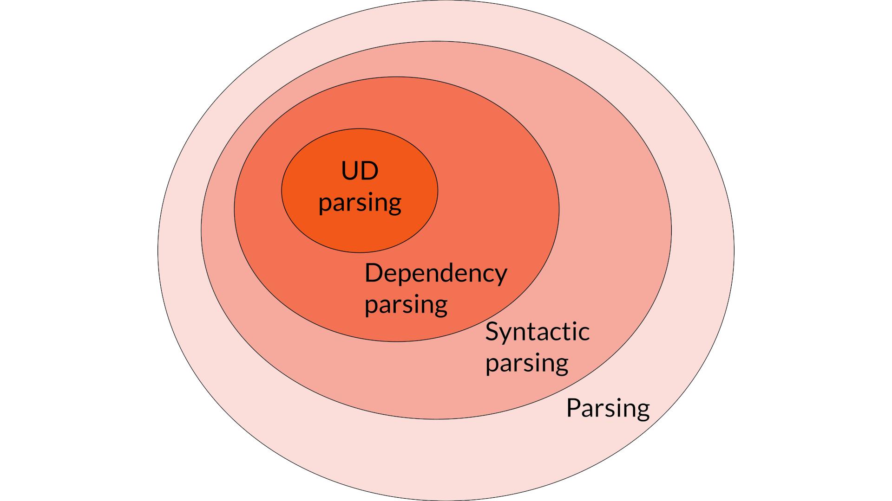
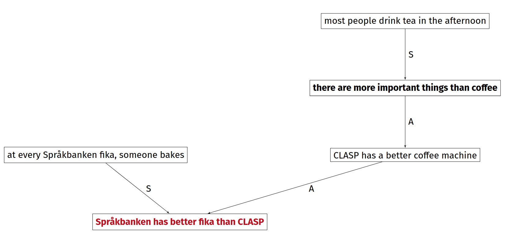
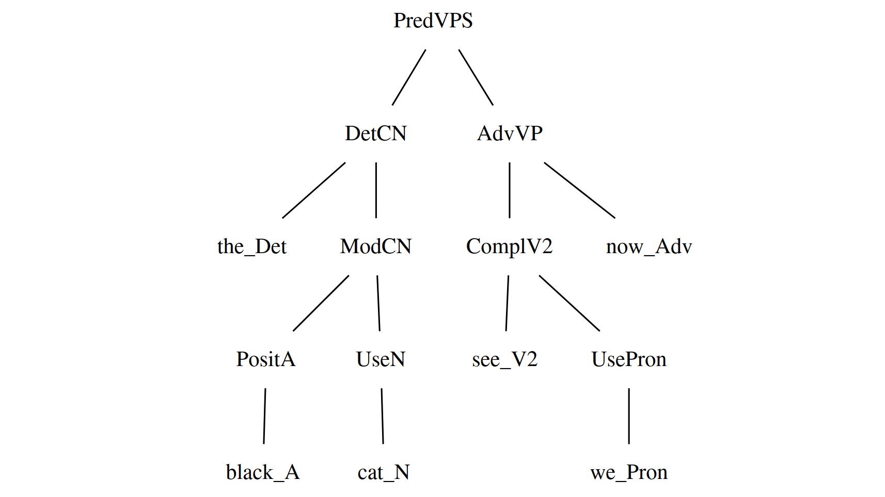
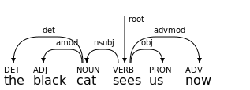

## Today's topic
\bigskip \bigskip


# Parsing

## A structured prediction task
Sequence $\to$ structure, e.g.

- natural language sentence $\to$ syntax tree
- code $\to$ AST
- argumentative essay $\to$ argumentative structure
- ...

## Example (argmining)

> Språkbanken has better fika than CLASP: every fika, someone bakes. Sure, CLASP has a better coffee machine. On the other hand, there are more important things than coffee. In fact, most people drink tea in the afternoon.

## Example (argmining)


\footnotesize From "A gentle introduction to argumentation mining" (Lindahl et al., 2022)

# Syntactic parsing

## From sentence to tree
From chapter 18 of _Speech and Language Processing_, (Jurafsky & Martin, January 2024 draft):

> Syntactic parsing is the task of assigning a syntactic structure to a sentence

- the structure is usually a _syntax tree_
- two main classes of approaches:
  - constituency parsing (e.g. GF)
  - dependency parsing (e.g. UD)

## Example (GF)
```
MicroLang> i MicroLangEng.gf 
linking ... OK

Languages: MicroLangEng
7 msec
MicroLang> p "the black cat sees us now"
PredVPS (DetCN the_Det (AdjCN (PositA black_A) 
(UseN cat_N))) (AdvVP (ComplV2 see_V2 (UsePron 
we_Pron)) now_Adv)
```

## Example (GF)
```haskell
PredVPS 
    (DetCN 
        the_Det 
        (AdjCN (PositA black_A) (UseN cat_N))
    ) 
    (AdvVP 
        (ComplV2 see_V2 (UsePron we_Pron)) 
        now_Adv
    )
```

## Example (GF) 


# Dependency parsing

## Example (UD)


\small
```
1	the	_	DET	_	_	3	det	_	_
2	black	_	ADJ	_	_	3	amod	_	_
3	cat	_	NOUN	_	_	4	nsubj	_	_
4	sees	_	VERB	_	_	0	root	_	_
5	us	_	PRON	_	_	4	obj	_	_
6	now	_	ADV	_	_	4	advmod	_	_
```

## Two paradigms
- __graph-based algorithms__: find the optimal tree from the set of all possible candidate solutions (or a subset of it)
- __transition-based algorithms__: incrementally build a tree by solving a sequence of classification problems

## Graph-based approaches
$$\hat{t} = \underset{t \in T(s)}{argmax}\, score(s,t)$$

- $t$: candidate tree
- $\hat{t}$: predicted tree
- $s$: input sentence
- $T(s)$: set of candidate trees for $s$ 

## Complexity
Depends on:

- choice of $T$ (upper bound: $n^{n-1}$, where $n$ is the number of words in $s$)
- scoring function (in the __arc-factor model__, the score of a tree is the sum of the score of each edge, scored individually by a NN)


In practice: $O(n^3)$ complexity

## Transition-based approaches
- trees are built through a sequence of steps, called _transitions_
- training requires:
  - a gold-standard treebank (as for graph-based approaches)
  - an _oracle_ i.e. an algorithm that converts each tree into a a gold-standard sequence of transitions
- much more efficient: $O(n)$

## Evaluation
2 main metrics:

- __UAS__ (Unlabelled Attachment Score): what's the fraction of nodes are attached to the correct dependency head?
- __LAS__ (Labelled Attachment Score): what's the fraction of nodes are attached to the correct dependency head _with an arc labelled with the correct relation type_[^1]?

[^1]: in UD: the `DEPREL` column

# Specifics of UD parsing

## Not just parsing per se
UD "parsers" typically do a lot more than dependency parsing:

- sentence segmentation
- tokenization
- lemmatization (`LEMMA` column)
- POS tagging (`UPOS` + `XPOS`)
- morphological tagging (`FEATS`)
- ...

Sometimes, some of these tasks are performed __jointly__ to achieve better performance.

## Evaluation (UD-specific)
Some more specific metrics:

- __CLAS__ (Content-word LAS): LAS limited to content words
- __MLAS__ (Morphology-Aware LAS): CLAS that also uses the `FEATS` column
- __BLEX__ (Bi-Lexical dependency score): CLAS that also uses the `LEMMA` column

## Evaluation script output
\small
```
Metric     | Precision |    Recall |  F1 Score | AligndAcc
-----------+-----------+-----------+-----------+-----------
Tokens     |    100.00 |    100.00 |    100.00 |
Sentences  |    100.00 |    100.00 |    100.00 |
Words      |    100.00 |    100.00 |    100.00 |
UPOS       |     98.36 |     98.36 |     98.36 |     98.36
XPOS       |    100.00 |    100.00 |    100.00 |    100.00
UFeats     |    100.00 |    100.00 |    100.00 |    100.00
AllTags    |     98.36 |     98.36 |     98.36 |     98.36
Lemmas     |    100.00 |    100.00 |    100.00 |    100.00
UAS        |     92.73 |     92.73 |     92.73 |     92.73
LAS        |     90.30 |     90.30 |     90.30 |     90.30
CLAS       |     88.50 |     88.34 |     88.42 |     88.34
MLAS       |     86.72 |     86.56 |     86.64 |     86.56
BLEX       |     88.50 |     88.34 |     88.42 |     88.34
```

## Three generations of parsers
(all transition-based)

1. __MaltParser__ (Nivre et al. 2006): "classic" transition-based parser, data-driven but not NN-based
2. __UDPipe__: neural parser, personal favorite
   - v1 (Straka et al. 2016): fast, solid software, easy to install and available anywhere
   - v2 (Straka et al. 2018): much better results but slower and only available through an API/via the web GUI
3. __MaChAmp__ (van der Goot et al. 2021): transformer-based toolkit for multi-task learning, works on all CoNNL-like data, close to the SOTA, relatively easy to install and train

## MaChAmp config example
```json
{"compsyn": {
    "train_data_path": "PATH-TO-YOUR-TRAIN-SPLIT",
    "dev_data_path": "PATH-TO-YOUR-DEV-SPLIT",
    "word_idx": 1,
    "tasks": {
        "upos": {
            "task_type": "seq",
            "column_idx": 3
        },
        "dependency": {
            "task_type": "dependency",
            "column_idx": 6}}}}
```

## Your task (lab 3)


1. annotate a small treebank for your language of choice (started yesterday)
2. __train a parser-tagger on a reference UD treebank__ (tomorrow, or maybe even today: installation)
3. evaluate it on your treebank

# To learn more

## Main sources
- chapters 18-19 of the January 2024 draft of _Speech and Language Processing_ (Jurafsky & Martin) (full text available [__here__](https://web.stanford.edu/~jurafsky/slp3/))
- unit 3-2 of Johansson & Kuhlmann's course "Deep Learning for Natural Language Processing" ([__slides and videos__](https://liu-nlp.ai/dl4nlp/modules/module3/))
- section 10.9.2 on parser evaluation from Aarne's course notes (on Canvas)

## Papers describing the parsers
- _MaltParser: A Data-Driven Parser-Generator for Dependency Parsing_ (Nivre et al. 2006) ([__PDF__](http://lrec-conf.org/proceedings/lrec2006/pdf/162_pdf.pdf))
- _UDPipe: Trainable Pipeline for Processing CoNLL-U Files Performing Tokenization, Morphological Analysis, POS Tagging and Parsing_ (Straka et al. 2016) ([__PDF__](https://aclanthology.org/L16-1680.pdf))
- _UDPipe 2.0 Prototype at CoNLL 2018 UD Shared Task_ (Straka et al. 2018) ([__PDF__](https://aclanthology.org/K18-2020.pdf))
- _Massive Choice, Ample Tasks (MACHAMP): A Toolkit for Multi-task Learning in NLP_ (van der Goot et al., 2021) ([__PDF__](https://arxiv.org/pdf/2005.14672))

## CSE courses you may like
1. [DIT231](https://www.gu.se/en/study-gothenburg/programming-language-technology-dit231) Programming language technology
   - build a complete compiler
2. [DIT301](https://www.gu.se/en/study-gothenburg/compiler-construction-dit301) Compiler construction 
   - the hardcore version of 1.
   - build another compiler _and optimize it_
3. DIT247 Machine learning for NLP (?)
   - has a module on dependency parsing similar to the one in "Deep Learning for Natural Language Processing"