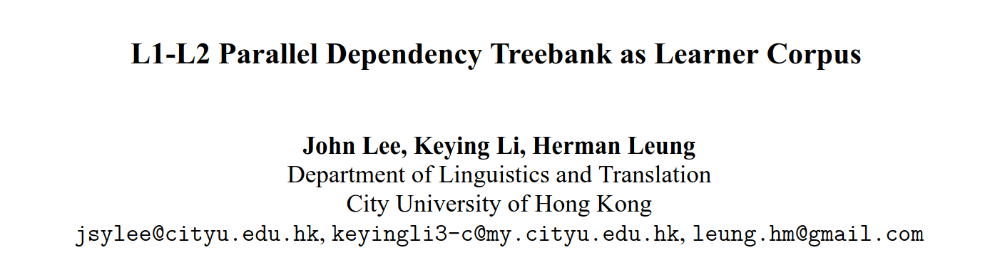

## Learner data

<!--see any problems?-->

\bigskip \bigskip

### English (FCE)
\small
```xml
I also suggest that more plays and films should 
<ns type="RV"> <ns type="FV"><i>be taken</i><c>take</c>
</ns> place</ns>.
```

### Italian (VALICO)
\small
```xml
Finse <MC><i>aveva paura</i><c>che aveva paura</c>
</MC> di un <DN><i>rapito</i><c>rapimento</c></DN>.
```

### Swedish (SweLL)
\small
```xml
<sentence> <w ref="1">"</w> <w ref="2" target_form="Det" 
correction_label="L-Ref">Den</w> <w ref="3">är</w> 
<w ref="4">en</w> <w ref="5">tredjedel</w> 
<w ref="6">av</w> <w ref="7">din</w> <w ref="8">dag</w> 
<w ref="9">!</w> </sentence>
```

## The problems
- coarse-grained error labels
- exclusive focus on errors
- lots of manual annotation needed
- lack of interoperability between corpora

## The solution: UD
- fine-grained morphosyntactic annotation <!--answers the first two-->
- parsers
- cross-linguistic consistency $\to$ possibility to compare:
  - L2 vs. standard
  - L1 vs. L2
  - different L2s

## L1-L2 treebanks

<!--I did not come up with this, or actually I did, but someone else had already-->



\bigskip

- L2 sentences $\parallel$ correction hypotheses <!--explain hypotheses-->
- no explicit error tagging

<!--I love parallel treebanks btw - concept-alignment thesis with Aarne-->

## UD treebanks of learner language
\bigskip

| **language** | **name** | **size** | **status**  | **parallel**   |
| ----------: | --------- | -------: | :-----------: | :--------: |
| Chinese      | CFL      | 451           | released    | **yes**\*\* | 
| English      | ESL      | 5124          | retired\*   | **yes**        |
| English      | ESLSpok  | 2320          | released    | no             |
| Italian      | Valico   | 398           | released    | **yes**        |
| Korean       | KSL      | 12977         | released    | no             |
| Russian      | ?        | 500           | WIP | **yes**        |
| \color{SecondaryColor}Swedish | \color{SecondaryColor}SweLL | \color{SecondaryColor}\~5000 | \color{SecondaryColor}WIP | \color{SecondaryColor}**yes** |

\footnotesize \*available for download but not part of the latest UD release
\newline\footnotesize \**only L2 half available

## Challenges
| **expectations** | **reality** |
| -----: | :----- |
| fine-grained annotation | when the validator allows that |
| parsers | don't work terribly well |
| cross-linguistic consistency | is limited to error-free spans |

## The `root` of the problem
The UD guidelines are designed with standard language in mind

- should we annotate the intended meaning (correction) and/or the observed language use?
- how to handle mismatches between the characteristics of individual tokens and their use in context?

# Treebanking SweLL

## Source corpus
__SweLL-gold__, aka the Swedish Learner Language corpus:

- __genre__: essays (misc topics)
- __learners__: adult L2 Swedish learners with various language backgrounds and proficiency levels
- __annotation__: error tagging, pseudonymization and normalization (minimal edits)
- __license__: CLARIN-ID -PRIV \underline{-NORED} -BY

## Example 0
\setlength{\unitlength}{0.20mm}
\begin{picture}(406.0,150.0)
  \put(0.0,0.0){Självklart}
  \put(100.0,0.0){\bfseries att}
  \put(155.0,0.0){\bfseries det}
  \put(201.0,0.0){\bfseries är}
  \put(238.0,0.0){viktigt}
  \put(311.0,0.0){.}
  \put(0.0,-11.0){{\scriptsize {\slshape of.course}}}
  \put(100.0,-11.0){{\scriptsize {\slshape that}}}
  \put(155.0,-11.0){{\scriptsize {\slshape it}}}
  \put(201.0,-11.0){{\scriptsize {\slshape is}}}
  \put(238.0,-11.0){{\scriptsize {\slshape important}}}
  \put(311.0,-11.0){{\scriptsize {\slshape .}}}
\end{picture}

\bigskip

- \small correction: "Självklart __är det__ viktigt."
- \small translation: "Of course it is important."

## Example 0
\setlength{\unitlength}{0.20mm}
\begin{picture}(406.0,150.0)
  \put(0.0,0.0){Självklart}
  \put(100.0,0.0){\bfseries att}
  \put(155.0,0.0){\bfseries det}
  \put(201.0,0.0){\bfseries är}
  \put(238.0,0.0){viktigt}
  \put(311.0,0.0){.}
  \put(0.0,15.0){{\tiny ADV}}
  \put(100.0,15.0){{\tiny SCONJ}}
  \put(155.0,15.0){{\tiny PRON}}
  \put(201.0,15.0){{\tiny AUX}}
  \put(238.0,15.0){{\tiny ADJ}}
  \put(311.0,15.0){{\tiny PUNCT}}
  \put(0.0,-11.0){{\scriptsize {\slshape of.course}}}
  \put(100.0,-11.0){{\scriptsize {\slshape that}}}
  \put(155.0,-11.0){{\scriptsize {\slshape it}}}
  \put(201.0,-11.0){{\scriptsize {\slshape is}}}
  \put(238.0,-11.0){{\scriptsize {\slshape important}}}
  \put(311.0,-11.0){{\scriptsize {\slshape .}}}
\end{picture}

\bigskip

- \small correction: "Självklart __är det__ viktigt."
- \small translation: "Of course it is important."

## Example 0
\setlength{\unitlength}{0.20mm}
\begin{picture}(406.0,150.0)
  \put(0.0,0.0){Självklart}
  \put(100.0,0.0){\bfseries att}
  \put(155.0,0.0){\bfseries det}
  \put(201.0,0.0){\bfseries är}
  \put(238.0,0.0){viktigt}
  \put(311.0,0.0){.}
  \put(0.0,15.0){{\tiny ADV}}
  \put(100.0,15.0){{\tiny SCONJ}}
  \put(155.0,15.0){{\tiny PRON}}
  \put(201.0,15.0){{\tiny AUX}}
  \put(238.0,15.0){{\tiny ADJ}}
  \put(311.0,15.0){{\tiny PUNCT}}
  \put(0.0,-11.0){{\scriptsize {\slshape of.course}}}
  \put(100.0,-11.0){{\scriptsize {\slshape that}}}
  \put(155.0,-11.0){{\scriptsize {\slshape it}}}
  \put(201.0,-11.0){{\scriptsize {\slshape is}}}
  \put(238.0,-11.0){{\scriptsize {\slshape important}}}
  \put(311.0,-11.0){{\scriptsize {\slshape .}}}
  \put(15.0,150.0){\vector(0,-1){120.0}}
  \put(20.0,140.0){{\tiny root}}
  \put(179.0,30.0){\oval(135.82608695652175,100.0)[t]}
  \put(111.08695652173913,35.0){\vector(0,-1){5.0}}
  \put(170.0,83.0){{\tiny mark}}
  \put(206.5,30.0){\oval(79.3855421686747,66.66666666666667)[t]}
  \put(166.80722891566265,35.0){\vector(0,-1){5.0}}
  \put(195.25,66.33333333333334){{\tiny nsubj}}
  \put(229.5,30.0){\oval(28.89189189189189,33.333333333333336)[t]}
  \put(215.05405405405406,35.0){\vector(0,-1){5.0}}
  \put(222.75,49.66666666666667){{\tiny cop}}
  \put(139.0,30.0){\oval(236.73949579831933,133.33333333333334)[t]}
  \put(257.3697478991597,35.0){\vector(0,-1){5.0}}
  \put(127.75,99.66666666666667){{\tiny csubj}}
  \put(175.5,30.0){\oval(310.0353697749196,166.66666666666666)[t]}
  \put(330.51768488745984,35.0){\vector(0,-1){5.0}}
  \put(164.25,116.33333333333333){{\tiny punct}}
\end{picture}

\bigskip

- \small correction: "Självklart __är det__ viktigt."
- \small translation: "Of course it is important."

## Example 1
\setlength{\unitlength}{0.23mm}
\begin{picture}(409.0,130.0)
  \put(0.0,0.0){Jag}
  \put(46.0,0.0){hade}
  \put(92.0,0.0){\bfseries emotskänslor}
  \put(200.0,0.0){fast}
  \put(270.0,0.0){jag}
  \put(311.0,0.0){\bfseries var}
  \put(348.0,0.0){\bfseries vänta}
  \put(403.0,0.0){det}
  \put(0.0,-11.0){{\scriptsize {\slshape I}}}
  \put(46.0,-11.0){{\scriptsize {\slshape had}}}
  \put(92.0,-11.0){{\scriptsize {\slshape againstfeelings}}}
  \put(200.0,-11.0){{\scriptsize {\slshape although}}}
  \put(270.0,-11.0){{\scriptsize {\slshape I}}}
  \put(311.0,-11.0){{\scriptsize {\slshape was}}}
  \put(348.0,-11.0){{\scriptsize {\slshape wait}}}
  \put(403.0,-11.0){{\scriptsize {\slshape that}}}
\end{picture}    

\bigskip

- \small correction: "Jag hade __motstridiga känslor__ fast jag __hade väntat mig__ det"
- \small translation: "I had mixed feelings although I was expecting that"

## Example 1
\setlength{\unitlength}{0.23mm}
\begin{picture}(409.0,130.0)
  \put(0.0,0.0){Jag}
  \put(46.0,0.0){hade}
  \put(92.0,0.0){\bfseries emotskänslor}
  \put(200.0,0.0){fast}
  \put(270.0,0.0){jag}
  \put(311.0,0.0){\bfseries var}
  \put(348.0,0.0){\bfseries vänta}
  \put(403.0,0.0){det}
  \put(0.0,15.0){{\tiny PRON}}
  \put(46.0,15.0){{\tiny VERB}}
  \put(92.0,15.0){{\tiny NOUN}}
  \put(200.0,15.0){{\tiny SCONJ}}
  \put(270.0,15.0){{\tiny PRON}}
  \put(311.0,15.0){{\tiny AUX}}
  \put(348.0,15.0){{\tiny VERB}}
  \put(403.0,15.0){{\tiny PRON}}
  \put(0.0,-11.0){{\scriptsize {\slshape I}}}
  \put(46.0,-11.0){{\scriptsize {\slshape had}}}
  \put(92.0,-11.0){{\scriptsize {\slshape againstfeelings}}}
  \put(200.0,-11.0){{\scriptsize {\slshape although}}}
  \put(270.0,-11.0){{\scriptsize {\slshape I}}}
  \put(311.0,-11.0){{\scriptsize {\slshape was}}}
  \put(348.0,-11.0){{\scriptsize {\slshape wait}}}
  \put(403.0,-11.0){{\scriptsize {\slshape that}}}
\end{picture}    

\bigskip

- \small correction: "Jag hade __motstridiga känslor__ fast jag __hade väntat mig__ det"
- \small translation: "I had mixed feelings although I was expecting that"

## Example 1
\setlength{\unitlength}{0.23mm}
\begin{picture}(409.0,130.0)
  \put(0.0,0.0){Jag}
  \put(46.0,0.0){hade}
  \put(92.0,0.0){\bfseries emotskänslor}
  \put(200.0,0.0){fast}
  \put(270.0,0.0){jag}
  \put(311.0,0.0){\bfseries var}
  \put(348.0,0.0){\bfseries vänta}
  \put(403.0,0.0){det}
  \put(0.0,15.0){{\tiny PRON}}
  \put(46.0,15.0){{\tiny VERB}}
  \put(92.0,15.0){{\tiny NOUN}}
  \put(200.0,15.0){{\tiny SCONJ}}
  \put(270.0,15.0){{\tiny PRON}}
  \put(311.0,15.0){{\tiny AUX}}
  \put(348.0,15.0){{\tiny VERB}}
  \put(403.0,15.0){{\tiny PRON}}
  \put(0.0,-11.0){{\scriptsize {\slshape I}}}
  \put(46.0,-11.0){{\scriptsize {\slshape had}}}
  \put(92.0,-11.0){{\scriptsize {\slshape againstfeelings}}}
  \put(200.0,-11.0){{\scriptsize {\slshape although}}}
  \put(270.0,-11.0){{\scriptsize {\slshape I}}}
  \put(311.0,-11.0){{\scriptsize {\slshape was}}}
  \put(348.0,-11.0){{\scriptsize {\slshape wait}}}
  \put(403.0,-11.0){{\scriptsize {\slshape that}}}
  \put(33.0,30.0){\oval(39.47826086956522,33.333333333333336)[t]}
  \put(13.26086956521739,35.0){\vector(0,-1){5.0}}
  \put(21.75,49.66666666666667){{\tiny nsubj}}
  \put(61.0,130.0){\vector(0,-1){100.0}}
  \put(66.0,120.0){{\tiny root}}
  \put(89.0,30.0){\oval(39.47826086956522,33.333333333333336)[t]}
  \put(108.73913043478261,35.0){\vector(0,-1){5.0}}
  \put(82.25,49.66666666666667){{\tiny obj}}
  \put(289.0,30.0){\oval(135.82608695652175,100.0)[t]}
  \put(221.08695652173913,35.0){\vector(0,-1){5.0}}
  \put(280.0,83.0){{\tiny mark}}
  \put(316.5,30.0){\oval(79.3855421686747,66.66666666666667)[t]}
  \put(276.8072289156627,35.0){\vector(0,-1){5.0}}
  \put(305.25,66.33333333333334){{\tiny nsubj}}
  \put(339.5,30.0){\oval(28.89189189189189,33.333333333333336)[t]}
  \put(325.05405405405406,35.0){\vector(0,-1){5.0}}
  \put(332.75,49.66666666666667){{\tiny \bfseries ?}}
  \put(217.0,30.0){\oval(301.0066225165563,133.33333333333334)[t]}
  \put(367.50331125827813,35.0){\vector(0,-1){5.0}}
  \put(205.75,99.66666666666667){{\tiny advcl}}
  \put(395.5,30.0){\oval(49.54545454545455,33.333333333333336)[t]}
  \put(420.27272727272725,35.0){\vector(0,-1){5.0}}
  \put(388.75,49.66666666666667){{\tiny obj}}
\end{picture}    

\bigskip

- \small correction: "Jag hade __motstridiga känslor__ fast jag __hade väntat mig__ det"
- \small translation: "I had mixed feelings although I was expecting that"

## Example 1
\setlength{\unitlength}{0.23mm}
\begin{picture}(409.0,130.0)
  \put(0.0,0.0){Jag}
  \put(46.0,0.0){hade}
  \put(92.0,0.0){\bfseries emotskänslor}
  \put(200.0,0.0){fast}
  \put(270.0,0.0){jag}
  \put(311.0,0.0){\bfseries var}
  \put(348.0,0.0){\bfseries vänta}
  \put(403.0,0.0){det}
  \put(0.0,15.0){{\tiny PRON}}
  \put(46.0,15.0){{\tiny VERB}}
  \put(92.0,15.0){{\tiny NOUN}}
  \put(200.0,15.0){{\tiny SCONJ}}
  \put(270.0,15.0){{\tiny PRON}}
  \put(311.0,15.0){{\tiny AUX}}
  \put(348.0,15.0){{\tiny VERB}}
  \put(403.0,15.0){{\tiny PRON}}
  \put(0.0,-11.0){{\scriptsize {\slshape I}}}
  \put(46.0,-11.0){{\scriptsize {\slshape had}}}
  \put(92.0,-11.0){{\scriptsize {\slshape againstfeelings}}}
  \put(200.0,-11.0){{\scriptsize {\slshape although}}}
  \put(270.0,-11.0){{\scriptsize {\slshape I}}}
  \put(311.0,-11.0){{\scriptsize {\slshape was}}}
  \put(348.0,-11.0){{\scriptsize {\slshape wait}}}
  \put(403.0,-11.0){{\scriptsize {\slshape that}}}
  \put(33.0,30.0){\oval(39.47826086956522,33.333333333333336)[t]}
  \put(13.26086956521739,35.0){\vector(0,-1){5.0}}
  \put(21.75,49.66666666666667){{\tiny nsubj}}
  \put(61.0,130.0){\vector(0,-1){100.0}}
  \put(66.0,120.0){{\tiny root}}
  \put(89.0,30.0){\oval(39.47826086956522,33.333333333333336)[t]}
  \put(108.73913043478261,35.0){\vector(0,-1){5.0}}
  \put(82.25,49.66666666666667){{\tiny obj}}
  \put(289.0,30.0){\oval(135.82608695652175,100.0)[t]}
  \put(221.08695652173913,35.0){\vector(0,-1){5.0}}
  \put(280.0,83.0){{\tiny mark}}
  \put(316.5,30.0){\oval(79.3855421686747,66.66666666666667)[t]}
  \put(276.8072289156627,35.0){\vector(0,-1){5.0}}
  \put(305.25,66.33333333333334){{\tiny nsubj}}
  \put(339.5,30.0){\oval(28.89189189189189,33.333333333333336)[t]}
  \put(325.05405405405406,35.0){\vector(0,-1){5.0}}
  \put(332.75,49.66666666666667){{\tiny \bfseries aux:*}}
  \put(217.0,30.0){\oval(301.0066225165563,133.33333333333334)[t]}
  \put(367.50331125827813,35.0){\vector(0,-1){5.0}}
  \put(205.75,99.66666666666667){{\tiny advcl}}
  \put(395.5,30.0){\oval(49.54545454545455,33.333333333333336)[t]}
  \put(420.27272727272725,35.0){\vector(0,-1){5.0}}
  \put(388.75,49.66666666666667){{\tiny obj}}
\end{picture}    

\bigskip

- \small correction: "Jag hade __motstridiga känslor__ fast jag __hade väntat mig__ det"
- \small translation: "I had mixed feelings although I was expecting that"

## Example 2
\setlength{\unitlength}{0.23mm}
\begin{picture}(195.0,110.0)
  \put(0.0,0.0){en}
  \put(37.0,0.0){lång}
  \put(83.0,0.0){\bfseries bus}
  \put(129.0,0.0){\bfseries resa}
  \put(0.0,-13.0){{\scriptsize {\slshape a}}}
  \put(37.0,-13.0){{\scriptsize {\slshape long}}}
  \put(83.0,-13.0){{\scriptsize {\slshape bus}}}
  \put(129.0,-13.0){{\scriptsize {\slshape trip}}}
\end{picture}

\bigskip

- \small correction: "en lång __bussresa__"
- \small translation: "a long bus trip"

## Example 2
\setlength{\unitlength}{0.23mm}
\begin{picture}(195.0,110.0)
  \put(0.0,0.0){en}
  \put(37.0,0.0){lång}
  \put(83.0,0.0){\bfseries bus}
  \put(129.0,0.0){\bfseries resa}
  \put(0.0,15.0){{\tiny DET}}
  \put(37.0,15.0){{\tiny ADJ}}
  \put(83.0,15.0){{\tiny NOUN}}
  \put(129.0,15.0){{\tiny NOUN}}
  \put(0.0,-13.0){{\scriptsize {\slshape a}}}
  \put(37.0,-13.0){{\scriptsize {\slshape long}}}
  \put(83.0,-13.0){{\scriptsize {\slshape bus}}}
  \put(129.0,-13.0){{\scriptsize {\slshape trip}}}
\end{picture}

\bigskip

- \small correction: "en lång __bussresa__"
- \small translation: "a long bus trip"

## Example 2
\setlength{\unitlength}{0.23mm}
\begin{picture}(195.0,110.0)
  \put(0.0,0.0){en}
  \put(37.0,0.0){lång}
  \put(83.0,0.0){\bfseries bus}
  \put(129.0,0.0){\bfseries resa}
  \put(0.0,15.0){{\tiny DET}}
  \put(37.0,15.0){{\tiny ADJ}}
  \put(83.0,15.0){{\tiny NOUN}}
  \put(129.0,15.0){{\tiny NOUN}}
  \put(0.0,-13.0){{\scriptsize {\slshape a}}}
  \put(37.0,-13.0){{\scriptsize {\slshape long}}}
  \put(83.0,-13.0){{\scriptsize {\slshape bus}}}
  \put(129.0,-13.0){{\scriptsize {\slshape trip}}}
  \put(74.5,30.0){\oval(126.67441860465117,100.0)[t]}
  \put(11.162790697674417,35.0){\vector(0,-1){5.0}}
  \put(67.75,83.0){{\tiny det}}
  \put(93.0,30.0){\oval(88.73913043478261,66.66666666666667)[t]}
  \put(48.630434782608695,35.0){\vector(0,-1){5.0}}
  \put(84.0,66.33333333333334){{\tiny amod}}
  \put(116.0,30.0){\oval(39.47826086956522,33.333333333333336)[t]}
  \put(96.26086956521739,35.0){\vector(0,-1){5.0}}
  \put(75.5,49.66666666666667){{\tiny compound:*}}
  \put(144.0,110.0){\vector(0,-1){80.0}}
  \put(149.0,100.0){{\tiny root}}
\end{picture}

\bigskip

- \small correction: "en lång __bussresa__"
- \small translation: "a long bus trip"

## Example 3
\setlength{\unitlength}{0.23mm}
\begin{picture}(531.0,110.0)
  \small
  \put(0.0,0.0){\bfseries den}
  \put(46.0,0.0){\bfseries är}
  \put(83.0,0.0){\bfseries smog}
  \put(129.0,0.0){salt}
  \put(175.0,0.0){och}
  \put(230.0,0.0){det}
  \put(276.0,0.0){bra}
  \put(313.0,0.0){för}
  \put(350.0,0.0){\bfseries all}
  \put(387.0,0.0){\bfseries kropen}
  \put(0.0,15.0){{\tiny PRON}}
  \put(46.0,15.0){{\tiny AUX}}
  \put(83.0,15.0){{\tiny NOUN}}
  \put(129.0,15.0){{\tiny NOUN}}
  \put(175.0,15.0){{\tiny CCONJ}}
  \put(230.0,15.0){{\tiny PRON}}
  \put(276.0,15.0){{\tiny ADJ}}
  \put(313.0,15.0){{\tiny ADP}}
  \put(350.0,15.0){{\tiny DET}}
  \put(387.0,15.0){{\tiny NOUN}}
  \put(0.0,-13.0){{\scriptsize {\slshape it}}}
  \put(46.0,-13.0){{\scriptsize {\slshape is}}}
  \put(83.0,-13.0){{\scriptsize {\slshape taste?}}}
  \put(129.0,-13.0){{\scriptsize {\slshape salt}}}
  \put(175.0,-13.0){{\scriptsize {\slshape and}}}
  \put(230.0,-13.0){{\scriptsize {\slshape it}}}
  \put(276.0,-13.0){{\scriptsize {\slshape good}}}
  \put(313.0,-13.0){{\scriptsize {\slshape for}}}
  \put(350.0,-13.0){{\scriptsize {\slshape all}}}
  \put(387.0,-13.0){{\scriptsize {\slshape the.body}}}
  \put(51.5,30.0){\oval(79.3855421686747,66.66666666666667)[t]}
  \put(11.807228915662648,35.0){\vector(0,-1){5.0}}
  \put(40.25,66.33333333333334){{\tiny nsubj}}
  \put(74.5,30.0){\oval(28.89189189189189,33.333333333333336)[t]}
  \put(60.054054054054056,35.0){\vector(0,-1){5.0}}
  \put(67.75,49.66666666666667){{\tiny cop}}
  \put(98.0,110.0){\vector(0,-1){80.0}}
  \put(103.0,100.0){{\tiny root}}
  \put(126.0,30.0){\oval(39.47826086956522,33.333333333333336)[t]}
  \put(145.73913043478262,35.0){\vector(0,-1){5.0}}
  \put(117.0,49.66666666666667){{\tiny nmod}}
  \put(235.5,30.0){\oval(98.02970297029702,66.66666666666667)[t]}
  \put(186.4851485148515,35.0){\vector(0,-1){5.0}}
  \put(231.0,66.33333333333334){{\tiny cc}}
  \put(263.0,30.0){\oval(39.47826086956522,33.333333333333336)[t]}
  \put(243.26086956521738,35.0){\vector(0,-1){5.0}}
  \put(251.75,49.66666666666667){{\tiny nsubj}}
  \put(199.5,30.0){\oval(191.4455958549223,100.0)[t]}
  \put(295.22279792746116,35.0){\vector(0,-1){5.0}}
  \put(190.5,83.0){{\tiny conj}}
  \put(360.0,30.0){\oval(69.94594594594595,66.66666666666667)[t]}
  \put(325.02702702702703,35.0){\vector(0,-1){5.0}}
  \put(351.0,66.33333333333334){{\tiny case}}
  \put(378.5,30.0){\oval(28.89189189189189,33.333333333333336)[t]}
  \put(364.05405405405406,35.0){\vector(0,-1){5.0}}
  \put(371.75,49.66666666666667){{\tiny det}}
  \put(351.5,30.0){\oval(108.29729729729729,100.0)[t]}
  \put(405.64864864864865,35.0){\vector(0,-1){5.0}}
  \put(344.75,83.0){{\tiny obl}}
\end{picture}

\bigskip

- \small correction: "__Det smakar__ salt och det __är__ bra för __hela kroppen__"
- \small translation: "it tastes salt and it's good for the whole body"

## Example 3: parser output
\setlength{\unitlength}{0.23mm}
\begin{picture}(531.0,110.0)
  \put(0.0,0.0){\bfseries den}
  \put(46.0,0.0){\bfseries är}
  \put(83.0,0.0){\bfseries smog}
  \put(129.0,0.0){salt}
  \put(175.0,0.0){och}
  \put(230.0,0.0){det}
  \put(276.0,0.0){bra}
  \put(313.0,0.0){för}
  \put(350.0,0.0){\bfseries all}
  \put(387.0,0.0){\bfseries kropen}
  \put(0.0,15.0){{\tiny PRON}}
  \put(46.0,15.0){{\tiny AUX}}
  \put(83.0,15.0){{\tiny \color{SecondaryColor} ADV}}
  \put(129.0,15.0){{\tiny \color{SecondaryColor} ADJ}}
  \put(175.0,15.0){{\tiny CCONJ}}
  \put(230.0,15.0){{\tiny PRON}}
  \put(276.0,15.0){{\tiny ADJ}}
  \put(313.0,15.0){{\tiny ADP}}
  \put(350.0,15.0){{\tiny DET}}
  \put(387.0,15.0){{\tiny NOUN}}
  \put(74.5,30.0){\oval(126.67441860465117,100.0)[t]}
  \put(11.162790697674417,35.0){\vector(0,-1){5.0}}
  \put(63.25,83.0){{\tiny nsubj}}
  \put(97.5,30.0){\oval(79.3855421686747,66.66666666666667)[t]}
  \put(57.80722891566265,35.0){\vector(0,-1){5.0}}
  \put(90.75,66.33333333333334){{\tiny cop}}
  \put(116.0,30.0){\color{SecondaryColor} \oval(39.47826086956522,33.333333333333336)[t]}
  \put(96.26086956521739,35.0){\color{SecondaryColor} \vector(0,-1){5.0}}
  \put(102.5,49.66666666666667){{\tiny \color{SecondaryColor} advmod}}
  \put(144.0,110.0){\color{SecondaryColor} \vector(0,-1){80.0}}
  \put(149.0,100.0){{\tiny \color{SecondaryColor} root}}
  \put(235.5,30.0){\oval(98.02970297029702,66.66666666666667)[t]}
  \put(186.4851485148515,35.0){\vector(0,-1){5.0}}
  \put(231.0,66.33333333333334){{\tiny cc}}
  \put(263.0,30.0){\oval(39.47826086956522,33.333333333333336)[t]}
  \put(243.26086956521738,35.0){\vector(0,-1){5.0}}
  \put(251.75,49.66666666666667){{\tiny nsubj}}
  \put(222.5,30.0){\oval(144.9591836734694,100.0)[t]}
  \put(294.9795918367347,35.0){\vector(0,-1){5.0}}
  \put(213.5,83.0){{\tiny conj}}
  \put(360.0,30.0){\oval(69.94594594594595,66.66666666666667)[t]}
  \put(325.02702702702703,35.0){\vector(0,-1){5.0}}
  \put(351.0,66.33333333333334){{\tiny case}}
  \put(378.5,30.0){\oval(28.89189189189189,33.333333333333336)[t]}
  \put(364.05405405405406,35.0){\vector(0,-1){5.0}}
  \put(371.75,49.66666666666667){{\tiny det}}
  \put(351.5,30.0){\oval(108.29729729729729,100.0)[t]}
  \put(405.64864864864865,35.0){\vector(0,-1){5.0}}
  \put(344.75,83.0){{\tiny obl}}
\end{picture}

\bigskip \bigskip 

\footnotesize (obtained with the UDPipe 2 Talbanken 2.15 model)

<!--and this is without FEATS and LEMMA!-->

## Our principles
- the validator is a tool, not a goal:
  - __*literal* criteria at the token level__
  - __*distributional* criteria at the syntax level__
  - __borrow from L1__ guidelines when necessary
- __correction-aware annotation__: the annotation of learner sentences should be consistent with the semantics of the correction hypothesis

## Status
- guidelines and test set (200/500 sentences) WIP
- remaining 5000 + 500 sentences TODO \pause
  - you are welcome to __participate__!
    - you do _not_ have to be a native speaker 
      (in fact, none of the current annotators is)
    - you _might_ be able to do this as a course project

# Exploring parallel learner treebanks with STUnD

## STUnD
- _Sökverktyg för Tvåspråkiga Universal Dependencies-trädbanker_, or
- Search Tool for (parallel) Universal Dependencies Treebanks
- available at `demo.spraakbanken.gu.se/stund` (hopefully)

## Under the hood
1. identify subtree alignments
2. run the query on the LHS treebanks, looking for matching subtres
3. find the corresponding RHS subtree (and check if it matches the RHS-specific patters)

## Use cases
- error retrieval: patterns (queries) $\to$ trees
- pattern extraction: trees $\to$ patterns
- feedback comment generation: patterns $\to$ natural language comments <!--maybe goto mittsem slides-->

# Sources

## In order of appearance
- \small John Lee, Keying Li, and Herman Leung. _L1-L2 parallel dependency treebank as learner corpus_. In Proceedings of the 15th International Conference on Parsing Technologies, pages 44-49, Pisa, Italy, September 2017. Association for Computational Linguistics
- \small John Lee, Herman Leung, and Keying Li. _Towards Universal Dependencies for learner Chinese_. In Marie-Catherine de Marneffe, Joakim Nivre, and Sebastian Schuster, editors, Proceedings of the NoDaLiDa 2017 Workshop on Universal Dependencies (UDW 2017), pages 67-71, Gothenburg, Sweden, may 2017. Association for Computational Linguistics

## In order of appearance
- \small Yevgeni Berzak, Jessica Kenney, Carolyn Spadine, Jing Xian Wang, Lucia Lam, Keiko Sophie Mori, Sebastian Garza, and Boris Katz. _Universal Dependencies for learner English_. In Katrin Erk and Noah A. Smith, editors, Proceedings of the 54th Annual Meeting of the Association for Computational Linguistics (Volume 1: Long Papers), pages 737-746, Berlin, Germany, aug 2016. Association for Computational Linguistics.
- \small Elisa Di Nuovo, Manuela Sanguinetti, Alessandro Mazzei, Elisa Corino, and Cristina Bosco. _VALICO-UD: Treebanking an Italian learner corpus in Universal Dependencies_. IJCoL. Italian Journal of Computational Linguistics, 8(8-1), 2022

## In order of appearance
- \small Hakyung Sung and Gyu-Ho Shin. _Constructing a dependency treebank for second language learners of Korean_. In Nicoletta Calzolari, Min-Yen Kan, Veronique Hoste, Alessandro Lenci, Sakriani Sakti, and Nianwen Xue, editors, Proceedings of the 2024 Joint International Conference on Computational Linguistics, Language Resources and Evaluation (LREC-COLING 2024), pages 3747-3758, Torino, Italia, may 2024. ELRA and ICCL
- \small Hakyung Sung and Gyu-Ho Shin. _Second language Korean Universal Dependency treebank v1.2: Focus on data augmentation and annotation scheme refinement_. In Špela Arhar Holdt, Nikolai Ilinykh, Barbara Scalvini, Micaella Bruton, Iben Nyholm Debess, and Crina Madalina Tudor, editors, Proceedings of the Third Workshop on Resources and Representations for Under-Resourced Languages and Domains (RESOURCEFUL-2025), pages 13-19, Tallinn, Estonia, March 2025. University of Tartu Library, Estonia

## In order of appearance
- \small Alla Rozovskaya. _Universal Dependencies for learner Russian_. In Nicoletta Calzolari, Min-Yen Kan, Veronique Hoste, Alessandro Lenci, Sakriani Sakti, and Nianwen Xue, editors, Proceedings of the 2024 Joint International Conference on Computational Linguistics, Language Resources and Evaluation (LREC-COLING 2024), pages 17112-17119, Torino, Italia, may 2024. ELRA and ICCL
- \small Elena Volodina, Lena Granstedt, Arild Matsson, Beáta Megyesi, Ildikó Pilán, Julia Prentice, Dan Rosén, Lisa Rudebeck, Carl-Johan Schenström, Gunlög Sundberg, et al. _The SweLL language learner corpus: From design to annotation_. Northern European Journal of Language Technology, 6:67-104, 2019
- \small Arianna Masciolini. _A query engine for L1-L2 parallel dependency treebanks_. In Proceedings of the 24th Nordic Conference on Computational Linguistics (NoDaLiDa), pages 574--587, Tórshavn, Faroe Islands, May 2023. University of Tartu Library

## In order of appearance
- \small Arianna Masciolini, Elena Volodina, and Dana Dannélls. _Towards automatically extracting morphosyntactical error patterns from L1-L2 parallel dependency treebanks_. In Proceedings of the 18th Workshop on Innovative Use of NLP for Building Educational Applications (BEA 2023), pages 585-597, Toronto, Canada, jul 2023. Association for Computational Linguistics
- \small Arianna Masciolini and Márton A Tóth. _STUnD: ett Sökverktyg för Tvåspråkiga Universal Dependencies-trädbanker_. In Proceedings of the Huminfra Conference, pages 95-109, Gothenburg, Sweden, 2024

## To appear
- \small Arianna Masciolini, Herbert Lange and Márton A Tóth. _Exploring parallel corpora with STUnD: a Search Tool for Universal Dependencies_. In the upcoming Huminfra Handbook, Gothenburg, Sweden, __most likely__ 2025
- \small a paper about harmonization of UD guidelines for L2 treebanks (under review)